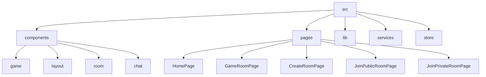

# NBG - Next-Gen Battle Gaming Platform

## 🗂️ Description

NBG is an innovative gaming platform that offers a variety of interactive game modes, including MCQ Quiz Battle and Drawing Challenge. The platform allows users to create and join game rooms, engage in real-time communication through a chat system, and compete with others in a fun and engaging environment. NBG is built using modern technologies such as React, Vite, and Node.js, ensuring a seamless and responsive gaming experience.

## ✨ Key Features

### Game Modes
* **MCQ Quiz Battle**: Engage in a quiz battle with other players, answering multiple-choice questions and competing for the top spot.
* **Drawing Challenge**: Showcase your artistic skills by drawing and guessing words, with a focus on creativity and speed.

### Core Features
* **Real-time Chat**: Communicate with other players in real-time using the chat system.
* **Game Room Creation**: Create and join game rooms with friends or other players.
* **Leaderboards**: Compete with others and track your progress on the leaderboards.

## 🗂️ Folder Structure



## 🛠️ Tech Stack


## ⚙️ Setup Instructions

To run the project locally, follow these steps:

* Clone the repository: `git clone https://github.com/Piyush-t24/NBG.git`
* Install dependencies: `npm install`
* Start the development server: `npm run dev`
* Open your browser and navigate to `http://localhost:5173`

## 🤖 GitHub Actions

The project uses GitHub Actions for continuous integration and deployment. The workflow is defined in the `.github/workflows/main.yml` file and includes the following steps:

* Build and test the project
* Deploy to a production environment

```yml
name: Build and Deploy

on:
  push:
    branches:
      - main

jobs:
  build-and-deploy:
    runs-on: ubuntu-latest
    steps:
      - name: Checkout code
        uses: actions/checkout@v2

      - name: Install dependencies
        run: npm install

      - name: Build and test
        run: npm run build && npm run test

      - name: Deploy
        uses: peaceiris/actions-gh-pages@v3
        with:
          github_token: ${{ secrets.GITHUB_TOKEN }}
          publish_dir: ./dist
```


<br><br>
<div align="center">

<h3>Piyush Gupta</h3>
<p>Student developer & tech enthusiast, contributing to open-source projects and participating in coding initiatives.</p>
</div>
<br>
<p align="right">
  <a href="https://gitfull.vercel.app">Made by GitFull</a>
</p>
    